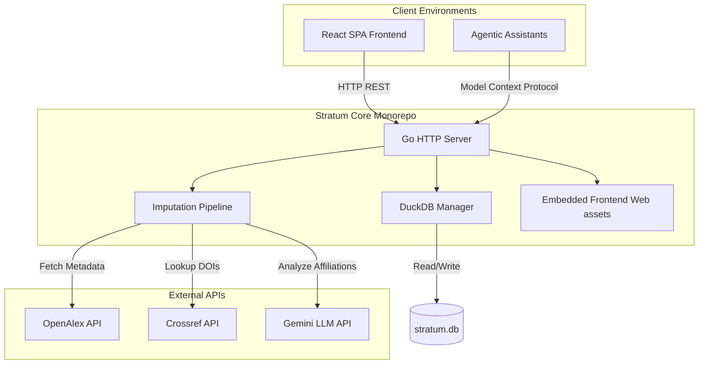

# Architecture Overview

Stratum consists of an integrated analytical database, an ingestion and enrichment pipeline, a REST API server, and a React frontend. This guide details how these components interact.

---

## 1. Backend Server & Engine

The backend is built in Go. Its responsibilities are split into several packages:

- **`main.go`**: Entry point that loads configuration, initializes the SQLite database (for application configurations and state), and starts the HTTP API server.
- **`db/`**: Handles interactions with the DuckDB database (using the `duckdb-go` driver). DuckDB is used for its fast columnar analytical querying capabilities. This package is also responsible for running migrations and initial schema setup.
- **`api/`**: Implements HTTP handlers for querying data, running pipelines, uploading files, and listing projects. It serves the compiled frontend assets using Go's `embed` package.
- **`openalex/`**: A wrapper for the OpenAlex API, supporting cursor pagination, concurrent fetching, and rate-limiting handles.
- **`impute/`**: Implements the imputation engine, coordinating Crossref DOI metadata lookups, LLM prompts via the Gemini API, and PDF text extracting using local scripts.
- **`tfidf/`**: Custom term-frequency calculations to extract key bibliographic terms across downloaded paper abstracts.

---

## 2. Ingestion and Imputation Pipelines

Data enters the system via a sequence of pipelines:

1. **Ingestion Pipeline**: Queries OpenAlex based on user keywords, downloading thousands of JSON records concurrently to a raw JSONL file.
2. **Conversion Pipeline**: Reads the JSONL file line-by-line, parses and flattens paper data, author metadata, institutions, and country mappings, and bulk loads them into DuckDB.
3. **Imputation Pipeline**: Scans the loaded DuckDB records for missing institution or country codes, then attempts imputation using:
   - **Crossref**: Querying publisher metadata by DOI.
   - **LLM**: Sending raw author affiliation strings to Gemini to categorize country/institution.
   - **PDF Parsing**: Reading local PDF files, extracting headers, and parsing affiliations.

---

## 3. Frontend Single Page Application (SPA)

The user interface is a single-page dashboard built with:
- **Vite & React**: Fast development server and builds.
- **Vanilla CSS**: Clean, premium monochrome styles that scale.
- **Embedded Deployment**: The build assets (`dist/`) are generated in the `web/` folder and compiled directly into the Go binary. When the Go server starts, it serves the React application on port `8080`.
