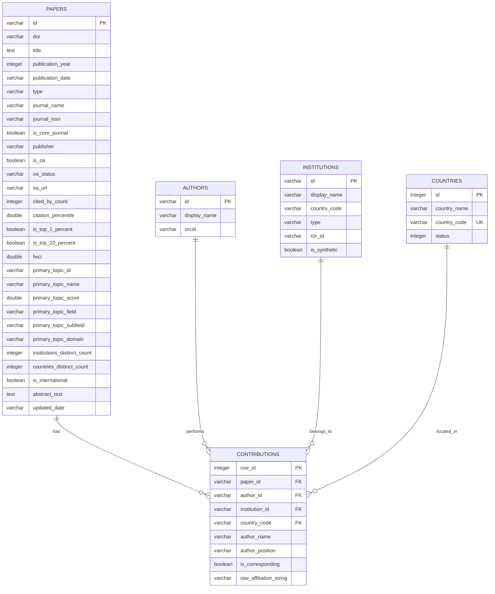

# Database Schema Reference

Stratum utilizes DuckDB for storing and analyzing bibliographic datasets. The schema consists of five main tables representing papers, authors, institutions, countries, and author contributions.

---

## 1. Table: `papers`
Stores bibliographic details, publication status, topic fields, and citation counts for each paper.

| Column Name | Type | Description |
| :--- | :--- | :--- |
| `id` | `VARCHAR` | Primary Key. The OpenAlex ID (e.g., `W218391283`). |
| `doi` | `VARCHAR` | Digital Object Identifier (e.g., `https://doi.org/10.1016/...`). |
| `title` | `TEXT` | Full title of the academic paper. |
| `publication_year` | `INTEGER` | Year of publication (e.g., `2024`). |
| `publication_date` | `VARCHAR` | Calendar date of publication. |
| `type` | `VARCHAR` | Document type (e.g., `article`, `book-chapter`, `conference-proceeding`). |
| `journal_name` | `VARCHAR` | Name of the journal or source venue. |
| `journal_issn` | `VARCHAR` | International Standard Serial Number of the venue. |
| `is_core_journal` | `BOOLEAN` | Boolean indicating if the venue is a core journal within our configurations. |
| `publisher` | `VARCHAR` | Publisher of the paper (e.g., `Elsevier`, `Springer`). |
| `is_oa` | `BOOLEAN` | Open Access status indicator. |
| `oa_status` | `VARCHAR` | Open Access category (e.g., `gold`, `green`, `hybrid`, `bronze`, `closed`). |
| `oa_url` | `VARCHAR` | Link to the Open Access version of the paper. |
| `cited_by_count` | `INTEGER` | Number of times this paper has been cited. |
| `citation_percentile` | `DOUBLE` | Citation performance percentile compared to same-year papers. |
| `is_top_1_percent` | `BOOLEAN` | True if citation count ranks in the top 1% globally for the year. |
| `is_top_10_percent` | `BOOLEAN` | True if citation count ranks in the top 10% globally for the year. |
| `fwci` | `DOUBLE` | Field-Weighted Citation Impact. |
| `primary_topic_id` | `VARCHAR` | Primary OpenAlex topic identifier. |
| `primary_topic_name` | `VARCHAR` | Topic display name. |
| `primary_topic_score` | `DOUBLE` | Topic relevance confidence score. |
| `primary_topic_field` | `VARCHAR` | Scientific field (e.g., `Computer Science`). |
| `primary_topic_subfield`| `VARCHAR` | Scientific subfield (e.g., `Software Engineering`). |
| `primary_topic_domain`  | `VARCHAR` | Scientific domain (e.g., `Physical Sciences`). |
| `institutions_distinct_count` | `INTEGER` | Count of unique institutions associated with the paper. |
| `countries_distinct_count` | `INTEGER` | Count of unique countries associated with the paper. |
| `is_international` | `BOOLEAN` | True if the paper involves authors from multiple countries. |
| `abstract_text` | `TEXT` | Full abstract content (reconstructed from OpenAlex inverted index). |
| `updated_date` | `VARCHAR` | Date this record was last modified in Stratum. |

---

## 2. Table: `authors`
Stores unique author identifiers and names.

| Column Name | Type | Description |
| :--- | :--- | :--- |
| `id` | `VARCHAR` | Primary Key. OpenAlex Author ID (e.g., `A5012398492`). |
| `display_name` | `VARCHAR` | Full name of the author. |
| `orcid` | `VARCHAR` | Open Researcher and Contributor ID (ORCID) URL. |

---

## 3. Table: `institutions`
Stores institutional metadata.

| Column Name | Type | Description |
| :--- | :--- | :--- |
| `id` | `VARCHAR` | Primary Key. OpenAlex Institution ID (e.g., `I136199984`). |
| `display_name` | `VARCHAR` | Full name of the academic or research institution. |
| `country_code` | `VARCHAR` | Two-letter ISO country code. |
| `type` | `VARCHAR` | Institution category (e.g., `education`, `company`, `government`). |
| `ror_id` | `VARCHAR` | Research Organization Registry ID (ROR URL). |
| `is_synthetic` | `BOOLEAN` | True if this institution was synthetically created during imputation. |

---

## 4. Table: `countries`
Standardized registry of countries.

| Column Name | Type | Description |
| :--- | :--- | :--- |
| `id` | `INTEGER` | Primary Key. Custom integer identifier. |
| `country_name` | `VARCHAR` | Full country name. |
| `country_code` | `VARCHAR` | Two-letter ISO country code (Unique). |
| `status` | `INTEGER` | Ingestion/matching status flag. |

---

## 5. Table: `contributions`
Maps authors and their institutions to papers, detailing position and raw affiliation strings.

| Column Name | Type | Description |
| :--- | :--- | :--- |
| `row_id` | `INTEGER` | Primary Key (automatically incremented via sequence `seq_contrib`). |
| `paper_id` | `VARCHAR` | Foreign Key pointing to `papers.id`. |
| `author_id` | `VARCHAR` | Foreign Key pointing to `authors.id`. |
| `institution_id` | `VARCHAR` | Foreign Key pointing to `institutions.id` (can be NULL). |
| `country_code` | `VARCHAR` | ISO country code representing the affiliation (can be NULL). |
| `author_name` | `VARCHAR` | Display name of the author as written on the paper. |
| `author_position` | `VARCHAR` | Position list (e.g. `first`, `middle`, `last`). |
| `is_corresponding`| `BOOLEAN` | Indicates if the author is the corresponding author. |
| `raw_affiliation_string` | `VARCHAR` | Original, unparsed affiliation text from the publisher's manuscript. |
