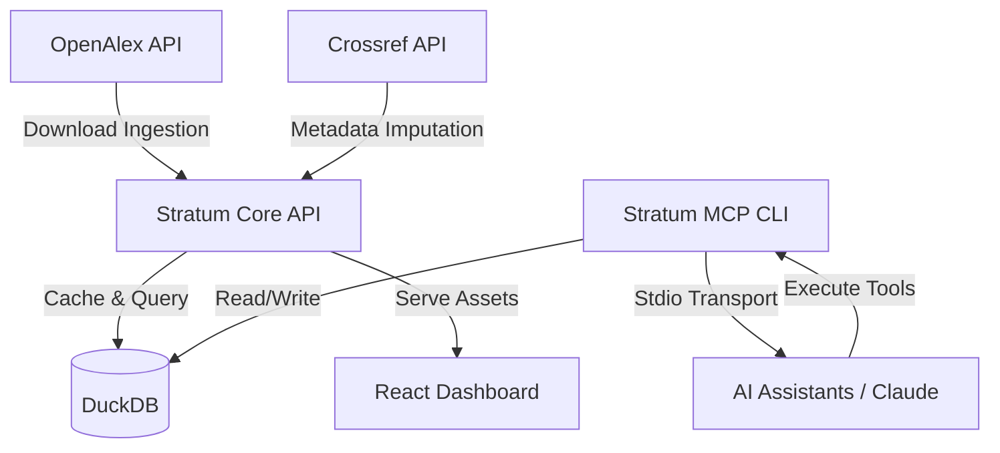

# Introduction to Stratum

Stratum is a high-performance bibliographic metadata retrieval, storage, and enrichment platform. It helps researchers, data scientists, and AI agents fetch academic paper metadata from APIs like OpenAlex and Crossref, store them in a fast local analytical database (DuckDB), and enrich/impute missing metadata such as institutional affiliations and countries.

---

## Key Features

1. **API Collection & Ingestion**: Concurrent, rate-limiting-aware downloads of paper metadata from OpenAlex based on custom keywords, topics, and filters.
2. **High-Speed Warehousing**: Imports large JSONL datasets into DuckDB tables, structuring paper records, authors, institutions, countries, and author-contribution records.
3. **Advanced Imputation & Enrichment**: Imputes missing author institution and country metadata using:
   - **Crossref API**: Querying DOIs for supplementary publisher metadata.
   - **LLM Imputation**: Performing semantic classification on raw affiliation strings.
   - **PDF Text Parsing**: Extracting raw text from PDF files using heuristics and LLMs to identify missing metadata.
4. **Interactive Dashboard**: A consolidated, sleek React Single Page Application (SPA) embedded directly in the Go server binary for running queries and visualization.
5. **Model Context Protocol (MCP)**: A standard MCP server to allow AI assistants (such as Claude Desktop or Gemini) to run research operations, validate filters, download datasets, and run SQL queries locally.

---

## Project Structure

Stratum is divided into two distinct repositories to keep core workflows and developer tooling separated:

- **[Stratum Core (Monorepo)](https://github.com/Darunesh1/stratum-core)**: Contains the main Go server, the SQLite configuration database, the DuckDB analytical database layer, and the React frontend.
- **[Stratum MCP (Standalone)](https://github.com/Darunesh1/stratum-mcp)**: A dedicated, lightweight Go package containing a standalone MCP server executable, ideal for developers who want to integrate Stratum tools directly into their AI workflows without running the full server UI.
